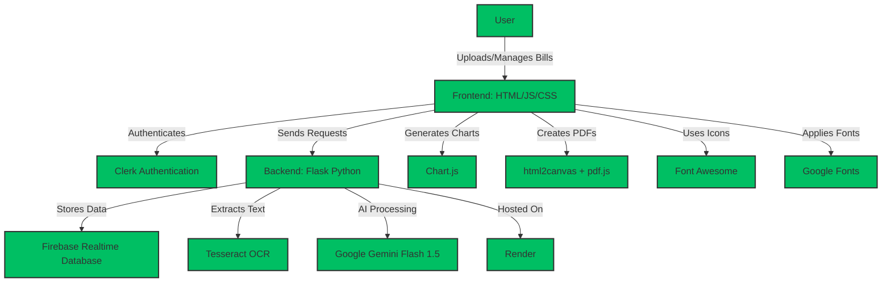

# Bills.ai

**Simplifying Your Bill Management!**

Bills.ai is an innovative solution that aims to streamline offline bill management using AI and provide comprehensive expense tracking and visualization.

## 🚀 Demo

[Link to live demo >](https://bills-ai.web.app/)

**Note:** API keys and database credentials have been removed from the codebase for security reasons. While you won't be able to run the code locally, the entire codebase is available for review. To see the application in action, please use the demo link provided above.

## 🎯 Problem Statement

Managing offline bills can be challenging, especially when it comes to organizing them for tax reimbursements, insurance claims, or personal expense tracking. There's a lack of effective tools for offline expense management, particularly for consumers and freelancers.

## 💡 Solution

Bills.ai offers a comprehensive solution for offline bill management:

- **AI-Powered Bill Processing**: Upload bills and let AI extract key information like title, amount, and bill type.
- **Manual Entry**: Option to manually add bill details.
- **Flexible Organization**: Sort bills by months and types.
- **Data Visualization**: Visualize expenses using line charts, sortable by months and expense categories.
- **Easy Editing**: Edit AI-extracted information if needed.
- **Download Options**: Get your original bill image or a complete bill summary across categories/months.
- **Expense Charts**: Download expense charts for various categories or time periods.
- **Currency Flexibility**: Choose your preferred currency.

## 🛠️ Technology Stack

- **Frontend**: HTML, CSS, JavaScript
- **Backend**: Flask (Python)
- **Database**: Firebase Realtime Database
- **Authentication**: Clerk
- **AI**: Google Gemini Flash 1.5
- **OCR**: Tesseract
- **Charts**: Chart.js
- **PDF Generation**: html2canvas, pdf.js
- **Icons**: Font Awesome
- **Fonts**: Google Fonts
- **Hosting**: Render (Backend)

## ✨ Key Features

1. AI-powered bill information extraction
2. Manual bill entry option
3. Sorting and categorization of bills
4. Expense visualization with interactive charts
5. Easy editing of AI-extracted information
6. Downloadable original bills and summaries
7. Expense chart downloads
8. Multi-currency support

## 📋 Use Cases

- Tax reimbursements
- Insurance claims
- Offline expense tracking for consumers
- Freelancer expense management
- Monthly or category-based budget tracking

## 🚀 Getting Started

1. Clone the repository
2. Install dependencies using requirements.txt
3. Replace the API Keys and database credentials for Gemini, Firebase and Clerk
4. Run the application using the Flask Backend

---

Built with ❤️ for effortless bill management and expense tracking.
